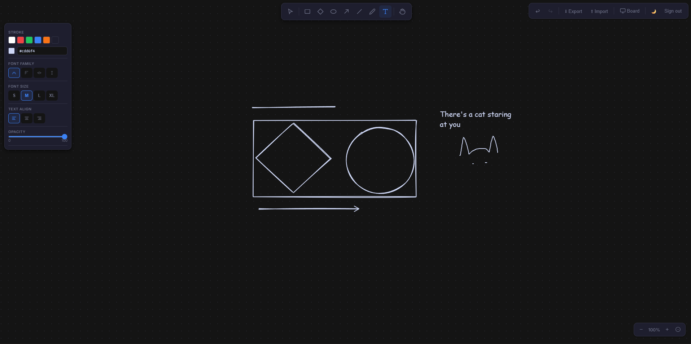

# Ceziladraw

A browser-based hand-drawn whiteboard built with TypeScript, Vite, and [Rough.js](https://roughjs.com/). Draw shapes, text, arrows, and freehand strokes with a sketchy aesthetic. Supports local-only mode or cloud sync via Supabase (workspaces, boards, Google sign-in).

---

## Features

- **Drawing tools**: Rectangle, diamond, ellipse, arrow, line, freehand pencil, and text
- **Selection & manipulation**: Select, drag, resize, rotate; marquee (area) selection
- **Contextual properties panel**: Stroke/fill colors (swatches + hex input + color picker), stroke width/style, sloppiness, corners (sharp/round), font family/size/align, opacity
- **Layers**: Bring forward, send backward, to front, to back
- **Actions**: Duplicate, delete, copy/paste
- **Undo / Redo**: Full history with patch-based diffs
- **Theme**: Light/dark mode with persistent preference
- **Cloud (optional)**: Sign in with Google; workspaces and multiple boards; auto-save to Supabase. Without env vars, runs locally with a single board in `localStorage`

---

## Screenshots



---

## Tech stack

- **Frontend**: Vanilla TypeScript, Vite, HTML/CSS
- **Rendering**: Canvas 2D API, Rough.js (hand-drawn style)
- **State**: In-memory stores (`AppState`, `UIState`) with observer pattern; no React/Vue
- **Persistence**: `localStorage` + optional Supabase (PostgreSQL, RLS, Auth)
- **Tests**: Vitest (unit), Playwright (e2e)

---

## Getting started

### Prerequisites

- Node.js 18+
- npm or pnpm

### Install and run

```bash
git clone <repo-url>
cd ceziladraw
npm install
npm run dev
```

Open the URL shown in the terminal (e.g. `http://localhost:5173`).

### Local-only mode

By default the app runs without Supabase: no sign-in, one board, data in `localStorage` only.

### Cloud mode (optional)

1. Create a project at [Supabase](https://supabase.com) and enable Google OAuth.
2. Copy `.env.example` to `.env` and set:
   - `VITE_SUPABASE_URL`
   - `VITE_SUPABASE_ANON_KEY`
3. Run the DB migrations (see `supabase/migrations/001_init.sql` or `supabase db push`).
4. Restart the dev server. You’ll see the sign-in overlay; after logging in you get workspaces and multiple boards with cloud save.

---

## Scripts

| Command | Description |
|--------|-------------|
| `npm run dev` | Start Vite dev server |
| `npm run build` | TypeScript check + production build |
| `npm run preview` | Serve production build locally |
| `npm run test:unit` | Run Vitest unit tests |
| `npm run test:e2e` | Build + Playwright e2e tests |
| `npm run test` | Unit + e2e |

---

## Project structure

- `src/types/` — Element and state types
- `src/state/` — App/UI state, history, clipboard
- `src/geometry/` — Transforms, hit detection, handles
- `src/renderer/` — Two-layer canvas (scene + interaction)
- `src/tools/` — Select, shape, text, pencil, hand tools
- `src/canvas/` — Canvas setup and event handling
- `src/storage/` — Serialization, localStorage, Supabase sync
- `src/auth/` — Auth gate, Google OAuth
- `src/lib/` — Supabase client and DB helpers
- `src/ui/` — Board picker UI

See [ARCHITECTURE.md](ARCHITECTURE.md) and the `ARCHITECTURE.md` files in each folder for details.

---

## License

Private / unlicensed unless stated otherwise.
